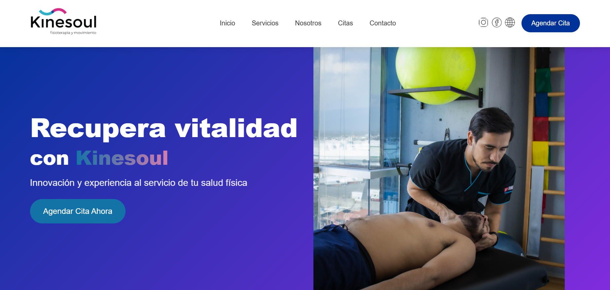

# Kinesoul Physiotherapy Website

Multipage website developed for a physiotherapy clinic using **HTML, CSS and JavaScript**.

This project was developed for a real physiotherapy clinic and later adapted as part of my frontend development portfolio.

The site provides information about treatments, medical specialties, contact options and appointment scheduling.

---

## Live Demo

Example:

https://yourdomain.com/kinesoul

---

## Preview



---

## Features

- Responsive design for desktop, tablet and mobile
- Mobile navigation with hamburger menu
- Sliding mobile menu
- Interactive service modal
- Services grid
- Medical specialties section
- Appointment page
- Contact page
- Social media integration
- Google Maps location link
- Clean multipage structure
- Lightweight Vanilla JavaScript interactions

---

## Technologies Used

- HTML5
- CSS3
- JavaScript (Vanilla JS)

---

## Project Structure

kinesoul-project/
│
├── index.html
│
├── pages/
│ ├── servicios.html
│ ├── nosotros.html
│ ├── citas.html
│ └── contacto.html
│
├── assets/
│ ├── css/
│ │ └── style.css
│ │
│ ├── js/
│ │ └── script.js
│ │
│ └── img/
│   └── preview/
│
├── README.md
└── LICENSE


---

## How to Run the Project

1. Clone the repository

```bash
git clone https://github.com/JohannesGuzman/kinesoul.git
```


2. Open the project folder.

3. Open the file:

index.html

in your browser.

No installation or dependencies are required.

## Project Purpose

This project was built to:

- develop a professional website for a real physiotherapy clinic
- implement a responsive multipage layout
- practice semantic HTML structure
- organize frontend projects with a professional folder structure
- implement interactive UI elements using vanilla JavaScript

## Author

Johannes Guzmán Guerrero
Frontend Developer

GitHub:
https://github.com/JohannesGuzman

## Client

This website was developed for a physiotherapy clinic.

The code structure and implementation are showcased here for portfolio purposes.
Brand assets and images belong to their respective owners.

## Disclaimer

This repository contains the frontend implementation used for the clinic website.  
Brand assets, logos and images belong to the clinic.